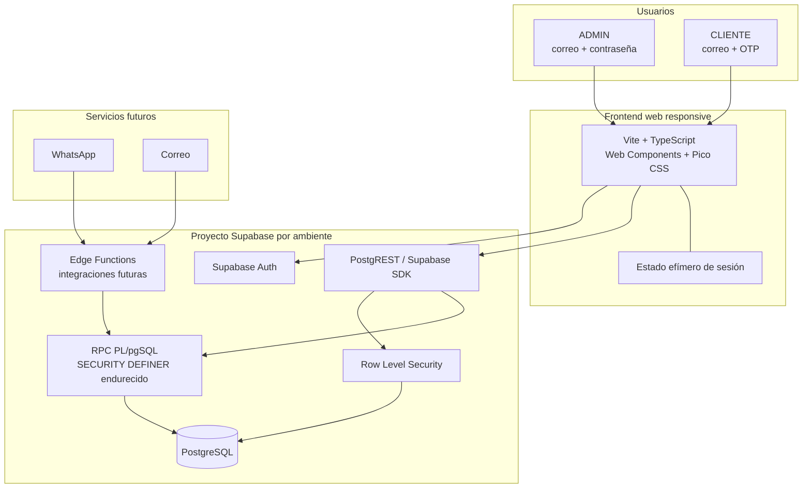
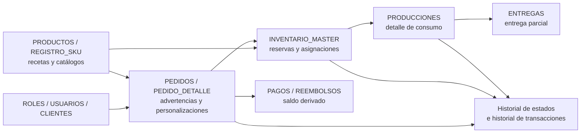
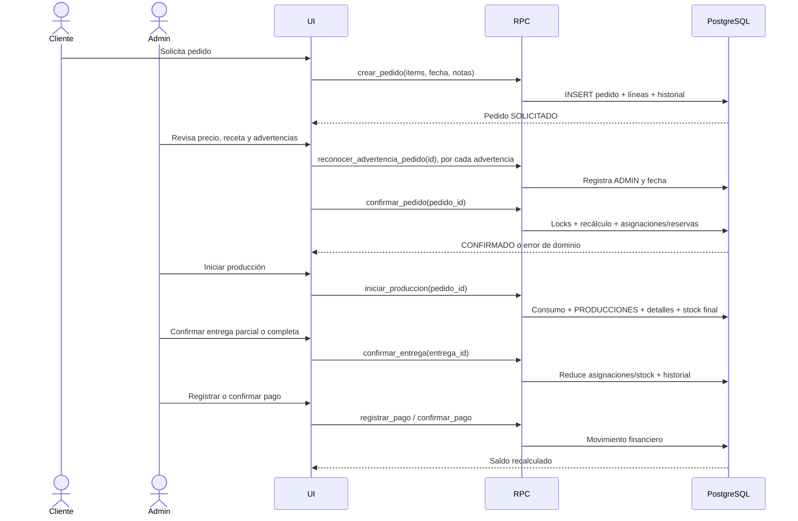
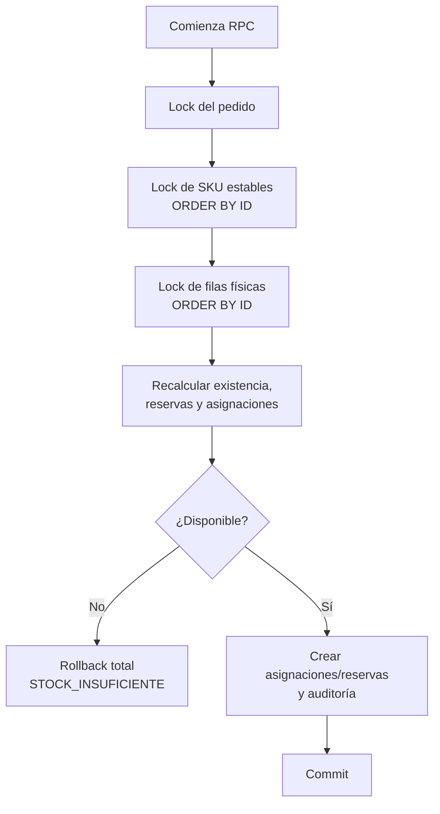
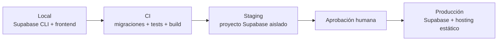

# Cookie Compass — Arquitectura y deployment

> Documento subordinado a `MASTER.md` v1.8. Describe la arquitectura objetivo;
> no afirma que los componentes estén implementados. Ante cualquier conflicto,
> prevalece `MASTER.md`.

## 1. Objetivos arquitectónicos

Cookie Compass debe ser simple de operar, económico, seguro para dinero e
inventario y usable desde teléfono, tablet o PC. PostgreSQL es la fuente de
verdad. El navegador presenta información y solicita operaciones; no decide
precios finales, permisos, reservas, consumos ni saldos.

## 2. Vista general



## 3. Capas y responsabilidades

| Capa | Responsabilidad | No debe hacer |
|---|---|---|
| UI | Formularios, navegación, estados de carga/error y accesibilidad | Autorizar, calcular saldos oficiales o manipular tablas críticas directamente |
| Supabase Auth | Identidad, sesión, contraseña ADMIN y OTP CLIENTE | Decidir por sí solo qué cliente empresarial corresponde al usuario |
| RLS | Aislamiento de lectura y bloqueo de escrituras directas | Sustituir validaciones internas de los RPC |
| RPC | Reglas de negocio, autorización explícita, locking, atomicidad y auditoría | Confiar en precio, rol, cliente o totales enviados por el navegador |
| PostgreSQL | Persistencia, constraints, índices, vistas y transacciones | Depender de `localStorage` como fuente de verdad |
| Edge Functions | Webhooks e integraciones externas futuras | Confirmar pedidos, pagos o inventario sin pasar por RPC y revisión humana |

Los RPC/SP emiten códigos `RFB_*`. `"RESOURCE_FILE_BASE"` centraliza
excepciones, validaciones y mensajes; la UI resuelve el texto sin acoplar su
contrato a frases largas dentro de las funciones.

## 4. Dominios principales



## 5. Flujo transaccional de un pedido



## 6. Seguridad

### 6.1 Identidad

- ADMIN: correo y contraseña.
- CLIENTE: OTP por correo.
- La relación entre `auth.users` y el negocio vive en `"USUARIOS"`.
- Un CLIENTE nunca elige su propio `"CLIENTE_ID"`.
- El primer ADMIN se crea mediante bootstrap controlado y no desde la UI
  pública.

### 6.2 Autorización

- Todas las tablas expuestas tienen RLS.
- `anon` no lee datos empresariales.
- CLIENTE solo accede a sus datos.
- Las escrituras críticas pasan por RPC.
- Las funciones `SECURITY DEFINER` califican esquemas, endurecen
  `search_path`, revocan ejecución a `PUBLIC` y validan usuario/rol activo.

### 6.3 Secretos

```text
Frontend:
VITE_SUPABASE_URL
VITE_SUPABASE_ANON_KEY

Nunca en frontend:
service_role
contraseñas
tokens administrativos
credenciales de base de datos
```

## 7. Concurrencia de inventario



El lock estable de SKU protege incluso la ausencia de una fila de inventario.
Todos los RPC respetan el mismo orden global. La disponibilidad se recalcula
después de adquirir los locks.

## 8. Ambientes



| Ambiente | Datos | Propósito |
|---|---|---|
| Local | Seeds ficticios | Desarrollo y pruebas destructivas |
| CI | Base efímera | Migraciones desde cero, tests SQL/RLS y build |
| Staging | Datos sintéticos | Validación integrada y aceptación |
| Producción | Datos reales | Operación del negocio |

Nunca se copian datos personales reales hacia local o CI.

## 9. Pipeline de deployment objetivo

1. Instalar dependencias con lockfile.
2. Levantar Supabase local o base efímera.
3. Aplicar todas las migraciones desde cero.
4. Ejecutar constraints, RPC, RLS y pruebas negativas.
5. Generar tipos TypeScript desde el esquema.
6. Ejecutar tests frontend y build.
7. Escanear secretos.
8. Desplegar migraciones en staging.
9. Ejecutar pruebas de humo y aceptación.
10. Requerir aprobación humana.
11. Aplicar migraciones compatibles en producción.
12. Desplegar el frontend estático.
13. Verificar salud, login y flujo mínimo.

No se despliega directamente desde una estación local sin evidencia de CI.

## 10. Estrategia de migraciones

- Toda modificación de esquema vive en una migración versionada.
- No se edita producción manualmente salvo incidente documentado.
- Las migraciones se prueban desde una base vacía y sobre una copia de
  estructura equivalente a la versión anterior.
- Cambios destructivos usan expansión/migración/contracción.
- Los catálogos técnicos se siembran mediante migración.
- Los catálogos comerciales se administran desde UI cuando su corte exista.

## 11. Observabilidad y operación

Registrar como mínimo:

- RPC y código de error de dominio;
- usuario y pedido afectados, sin secretos;
- `"USER_STAMP"`, `"PROCESS_STAMP"` y `"DATE_TIME_STAMP"` en toda fila;
- duración;
- deadlocks, timeouts y errores de serialización;
- fallos de autenticación y autorización;
- webhook externo e idempotency key en fases futuras.

Alertas iniciales:

- errores repetidos de RLS;
- fallos de RPC críticos;
- deadlock o `lock_timeout`;
- migración fallida;
- indisponibilidad de Supabase;
- crecimiento anormal de errores frontend.

Convención de escritura:

```text
USER_STAMP      = identidad de sesión AUTH:<uuid> o SYSTEM:<proceso>
PROCESS_STAMP   = RPC/proceso estable que escribió
DATE_TIME_STAMP = clock_timestamp() de PostgreSQL
```

El frontend no decide estos valores. Los establece un contexto transaccional
validado y un trigger común en todas las tablas.

## 12. Respaldo y recuperación

- Habilitar la estrategia de backups disponible en el plan de Supabase.
- Exportar y probar periódicamente la restauración en un ambiente aislado.
- Documentar RPO/RTO cuando el sistema entre en producción.
- No considerar un backup válido hasta verificar una restauración.
- Antes de migraciones de alto riesgo, confirmar punto de recuperación.

## 13. Hosting objetivo

- Frontend estático: Cloudflare Pages, Netlify o Vercel.
- Backend gestionado: Supabase.
- DNS/TLS: proveedor de hosting.
- Integraciones futuras: Supabase Edge Functions.

La selección final del hosting frontend se toma antes del primer deployment,
comparando costo, logs, variables de entorno, previews y controles de acceso.

## 14. Hardware sizing con 30% de holgura

> Dimensionamiento de referencia revisado el 2026-07-30. Los planes, precios
> y límites del proveedor deben verificarse nuevamente antes de contratar o
> cambiar capacidad.

### 14.1 Principio de dimensionamiento

La capacidad objetivo se calcula como:

```text
CAPACIDAD_OBJETIVO = CARGA_ESTIMADA × 1,30
```

El 30% adicional es reserva operativa para picos, crecimiento, autovacuum,
migraciones y pequeñas desviaciones de estimación. No debe consumirse como
capacidad normal.

Cuando el proveedor no ofrece exactamente el valor calculado, se selecciona
el siguiente tamaño comercial superior. Por eso producción comienza en
**Small**: Supabase no ofrece una instancia de 1,3 GB entre Micro (1 GB) y
Small (2 GB).

### 14.2 Supuestos de carga con margen

| Variable | Base estimada | Objetivo +30% |
|---|---:|---:|
| Administradores | 3 | 4 |
| Clientes iniciales | 1.000 | 1.300 |
| Usuarios simultáneos | 10 | 13 |
| Pedidos diarios normales | 30 | 39 |
| Pedidos diarios de pico | 100 | 130 |
| Líneas por pedido | 10 | 13 |
| Operaciones/movimientos por pedido | 50 | 65 |
| Crecimiento estimado de datos anual | 1 GB | 1,3 GB |
| Backup lógico inicial | 20 GB | 26 GB, redondeado a 30 GB |

Estos números no son límites del sistema; son la carga de diseño inicial que
debe soportarse sin consumir toda la infraestructura.

### 14.3 Producción administrada

| Recurso | Base sin margen | Selección con margen |
|---|---:|---:|
| Compute PostgreSQL | Micro: 2 cores compartidos, 1 GB RAM | **Small: 2 cores compartidos, 2 GB RAM** |
| Disco previsto inicial | 8 GB | **12 GB aprovisionados o presupuesto equivalente** |
| Conexiones directas | 60 | Small permite aproximadamente 90 |
| Conexiones mediante pooler | 200 | Small permite aproximadamente 400 |
| Backup lógico externo | 20 GB | **30 GB mínimo inicial** |
| Frontend | Hosting estático | CDN administrada, sin servidor propio |

Configuración recomendada:

```text
Plan Supabase: Pro
Compute producción: Small
RAM PostgreSQL: 2 GB
CPU: 2 cores compartidos
Disco presupuestado: 12 GB
Pooler: obligatorio para cargas serverless/integraciones
Frontend: hosting estático administrado
Servidor de aplicación propio: ninguno
```

El plan Pro incluye actualmente 8 GB de disco; el presupuesto de 12 GB
considera hasta 4 GB adicionales facturables si fueran necesarios. No se
preasigna crecimiento sin uso: se configuran alertas y presupuesto.

Referencia del proveedor:

- [Compute and Disk](https://supabase.com/docs/guides/platform/compute-and-disk)
- [Supabase Pricing](https://supabase.com/pricing)

### 14.4 Desarrollo local

| Recurso | Recomendación base | Recomendación +30% redondeada |
|---|---:|---:|
| CPU | 6–8 cores | **8–12 cores** |
| RAM total | 16 GB | 20,8 GB → **24 GB mínimo recomendado; 32 GB ideal** |
| RAM asignada a Docker | 8 GB | 10,4 GB → **12 GB** |
| Disco libre | 100 GB SSD | 130 GB → **150 GB SSD** |
| Disco físico del equipo | 512 GB SSD | **1 TB SSD recomendado** |

Configuración preferida:

```text
CPU: 8 cores o más
RAM: 32 GB
Disco: 1 TB NVMe, al menos 150 GB libres
Docker: 12 GB RAM asignada
Node.js: versión LTS compatible con Supabase CLI
```

Una estación con 16 GB todavía puede funcionar, pero no conserva el 30% de
holgura al ejecutar simultáneamente Docker, VS Code, navegador y pruebas.

La documentación de Supabase indica que el stack local completo necesita un
runtime compatible con Docker y recomienda al menos 7 GB asignados a Docker:
[Local development workflow](https://supabase.com/docs/guides/local-development/cli-workflows).

### 14.5 CI

| Tipo de ejecución | CPU | RAM | Disco temporal |
|---|---:|---:|---:|
| Build y tests normales | 4 cores | 8 GB | 30 GB SSD |
| Pruebas concurrentes Corte 3b | **6 cores** | **12–16 GB** | **40 GB SSD** |

Los runners son efímeros. No se mantiene un servidor de CI encendido
permanentemente.

### 14.6 Staging

Staging debe usar datos sintéticos y un proyecto separado.

```text
Opción económica:
Nano/Free, aceptando pausas.

Opción equivalente y estable:
Micro, 1 GB RAM, sin pausas si pertenece al plan pago.
```

El 30% de holgura se exige en producción; staging debe reproducir
funcionalidad y migraciones, no necesariamente rendimiento. Las pruebas de
carga definitivas se ejecutan contra un ambiente temporal con tamaño Small o
contra una ventana controlada equivalente.

### 14.7 Usuarios finales

| Usuario | Mínimo | Recomendado con margen |
|---|---:|---:|
| ADMIN en PC | 4 GB RAM, 2 cores | **8 GB RAM, 4 cores** |
| ADMIN en móvil/tablet | Navegador moderno | **4 GB RAM y sistema actualizado** |
| CLIENTE | Smartphone con correo y JavaScript | Navegador actualizado y conexión estable |
| Red | 5 Mbps | **10 Mbps**, latencia estable |

No se requiere GPU dedicada ni instalación local de la aplicación.

### 14.8 Backup y recuperación

Configuración inicial:

```text
Backup administrado: diario, según plan Pro
Dump lógico externo: diario
Almacenamiento externo: 30 GB inicial
Retención lógica: 30 días
Prueba de restauración: trimestral
PITR: diferido hasta que RPO de 24 horas sea inaceptable
```

El almacenamiento para dumps se revisa cuando llegue a 70% de utilización.
Los backups deben almacenarse cifrados fuera del mismo proyecto y deben
probarse mediante restauración.

Referencia:
[Database Backups](https://supabase.com/docs/guides/platform/backups).

### 14.9 Presupuesto mensual orientativo

Con precios vigentes al revisar este documento:

| Concepto | Estimación |
|---|---:|
| Supabase Pro | USD 25/mes |
| Small compute | USD 15/mes |
| Crédito de compute incluido | −USD 10/mes |
| Producción estimada | **USD 30/mes** |
| Staging Micro estable opcional | +USD 10/mes |
| Dominio/SMTP/almacenamiento adicional | Variable |
| Total base con staging estable | **aprox. USD 40–55/mes** |

No incluye PITR, que se evalúa por separado, ni integraciones pagadas de
WhatsApp o correo.

### 14.10 Umbrales de escalamiento

El 30% de reserva se considera consumido cuando cualquiera de estas métricas
se mantiene durante ventanas operacionales:

- CPU superior al 70%;
- memoria disponible inferior al 25%;
- pool de conexiones superior al 70%;
- disco superior al 70%;
- p95 de RPC interactivos superior a 500 ms, excluyendo espera legítima por
  locks;
- autovacuum atrasado;
- `lock_timeout`, deadlocks o errores de serialización recurrentes;
- pruebas de carga de 1,3 veces el pico esperado no cumplen criterios.

Orden de respuesta:

1. revisar consultas, índices, N+1 y planes de ejecución;
2. revisar conexiones y pooler;
3. verificar locks y duración transaccional;
4. corregir antes de escalar;
5. subir de Small a Medium solo si la carga legítima continúa superando la
   capacidad.

Más hardware no corrige sobreventa, orden inconsistente de locks, RLS
incorrecto ni consultas defectuosas.

### 14.11 Matriz de evolución

| Etapa | Compute | Condición |
|---|---|---|
| Desarrollo | Supabase local | Sin datos reales |
| Piloto productivo | **Small** | Selección inicial con 30% de holgura |
| Operación estable | Small | Mientras se mantengan los umbrales |
| Crecimiento | Medium | Solo después de optimización y evidencia |
| Alta demanda | Large+ | Fuera del alcance actual; requiere nueva evaluación |

## 15. Estado de implementación

| Área | Estado al crear este documento |
|---|---|
| Diseño de dominio | Consolidado en MASTER.md v1.8 |
| GO Corte 0 | Preparado, no ejecutado |
| Supabase local/migraciones | No implementado |
| Auth/RLS nuevo | No implementado |
| Inventario/pedidos/pagos nuevos | No implementados |
| Deployment | No ejecutado |
